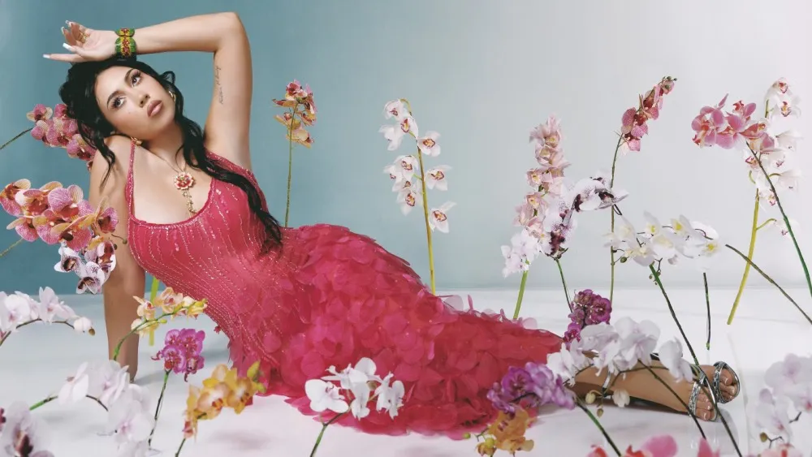
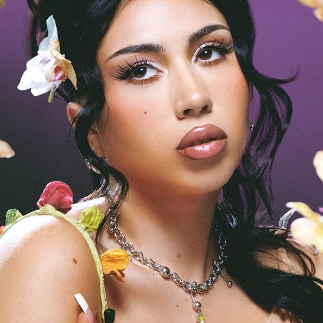

<!--Jullya Caroline 2°E 13/08/25 -->
<html lang="pt-br">
<head>
    <meta charset="UTF-8">
    <meta name="viewport" content="width=device-width, initial-scale=1">
    
<link rel="preconnect" href="https://fonts.googleapis.com">
    <title>Kali Uchis</title>
   
<!-- Bootstrap -->
<link href="https://cdnjs.cloudflare.com/ajax/libs/bootstrap/5.3.3/css/bootstrap.min.css" rel="stylesheet">
 <link rel="stylesheet" href="https://cdnjs.cloudflare.com/ajax/libs/bootstrap-icons/1.11.3/font/bootstrap-icons.min.css">
    <!-- meu css -->
    <link rel="stylesheet" href="style.css">
</head>
   
    <header class=" p-5">
<!-- Estilos  -->        
 <nav class="container d-flex justify-content-between align-items-center">
 
 <ul class="nav mt-5">
                <li class="nav-item"><a class="nav-link" href="#inicio">Início</a></li>
                <li class="nav-item"><a class="nav-link" href="#contato">Contato</a></li>
                <li class="nav-item"><a class="nav-link" href="#galeria">Galeria</a></li>
            </ul>
            <!-- Menu de Acessibilidade -->
        
 
        <button id="botao-acessibilidade" class="btn btn-primary fw-bold rotacao-botao" aria-expanded="false">acessibilidade</button>
        

                <button id="aumentar-fonte" class="btn btn-primary fw-bold" aria-label="Aumentar o tamanho da fonte">A+</button>
                <button id="diminuir-fonte" class="btn btn-primary fw-bold" aria-label="diminuir o tamanho da fonte">A-</button>
                <button id="alterna-contraste" class="btn btn-primary fw-bold" aria-label="Alterna o contraste de cores"> <i class="bi bi-shadows"></i></button>
        

       

    </nav>
</header>
<!-- Hero Section -->
<section id="Kali Uchis" class="my-5 pt-6 secao-Kali">
        

                

                        <h2> Quem é a cantora Kali Uchis</h2>
                        
Kali Uchis, cujo nome verdadeiro é Karly-Marina Loaiza, é uma cantora, compositora e produtora musical americana de origem colombiana. Ela é conhecida por sua mistura de gêneros musicais, incluindo R&B, soul, música latina e pop, e por suas letras introspectivas e pessoais. 

                

        

</section>
<section id="inicio" class="my-5">
        

                

                        <h1 class="display-4 text-white fst-italic fw-bold">Kali Uchis</h1>
                        
                        <a href="#kali Uchis"
                                class="btn btn-primary btn-lg botao-inicio fw-semibold">COUGHS, CC BY-SA 4.0 <https://creativecommons.org/licenses/by-sa/4.0>, via Wikimedia Commons
KaliUchisPerf.jpg

 
</section>

<section id="Kali Uchis" class="my-5 pt-6 secao-Kali Uchis">
        

                

                

                

                        <h2>Como ela alcançou o sucesso?</h2>
                        
Kali Uchis tornou-se famosa através de uma combinação de mixtape, EPs, álbuns aclamados pela crítica e colaborações com artistas influentes. Sua música, que mistura neo-soul, R&B, hip-hop e ritmos latinos, chamou a atenção de nomes como Tyler, The Creator e Diplo, que colaboraram em seu primeiro EP, Por Vida. O sucesso de seu álbum Isolation e da música Telepatía solidificou ainda mais sua posição na indústria musical. 

                

        

</section>

<section id="galeria">
        <h2 class="text-center pt-5">Galeria</h2>
        

        

                

                        

                                
                        

                        

                                
                        

                

                 

                                
                   

                        

                                
                        

                

         

</section>
</main>
<footer class="text center-p-3 fst-italic">
        
Entre em Contato:

        <i class="bi-bi-whatsapp"></i>
        <i class="bi-bi-instagram"></i>
        <i class="bi-bi-tiktok"></i>

Desenvolvido por Jullya 2°E.

</footer>

</body>

</html>